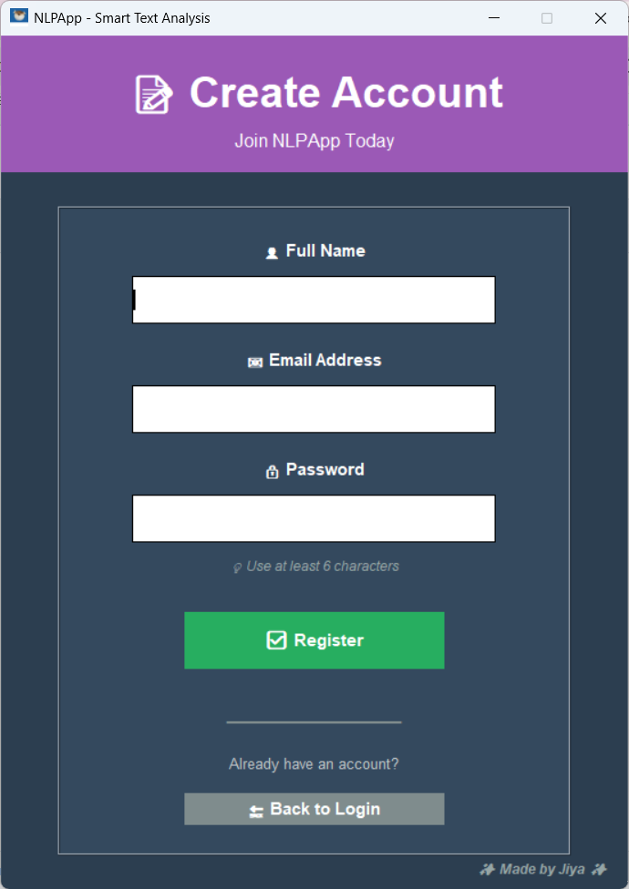
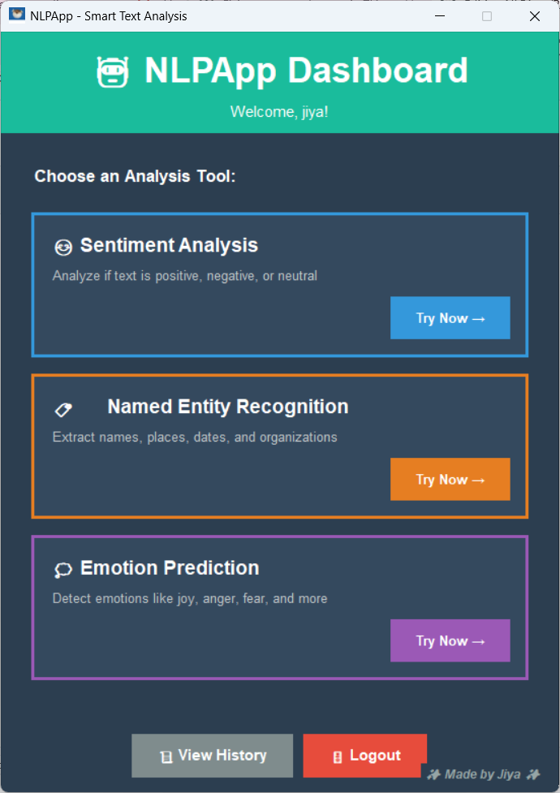
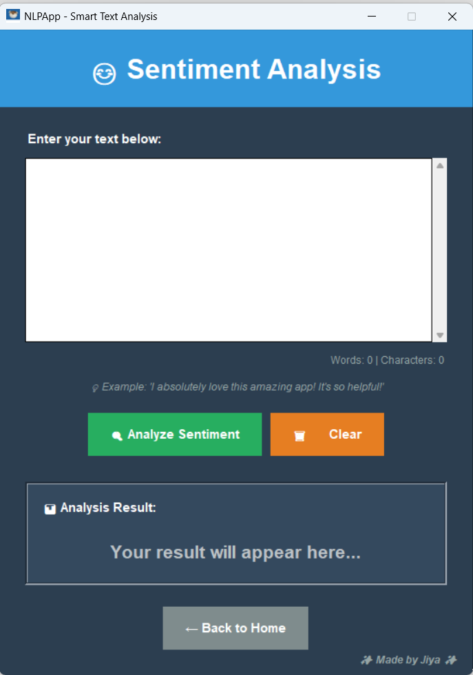
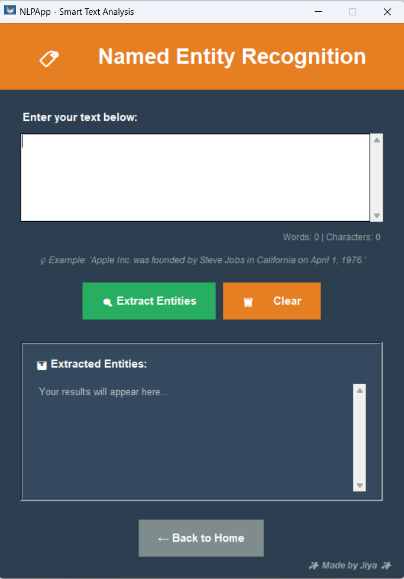
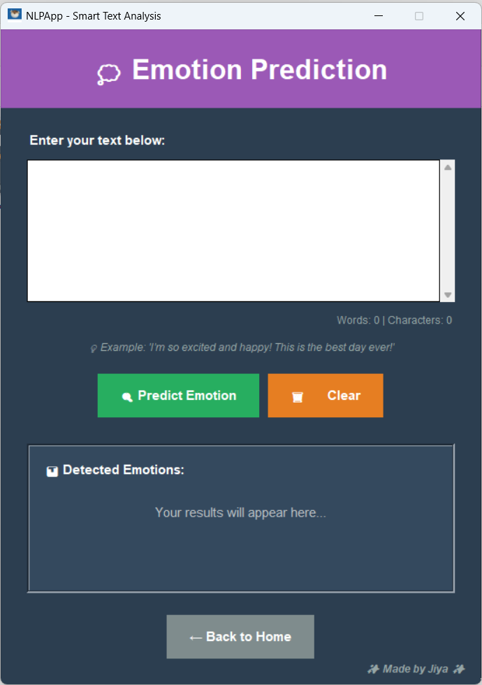

# 🤖 NLPApp - Smart Text Analysis Tool

[](https://www.python.org/downloads/)
[](LICENSE)
[](https://github.com/JIYA1220)

A user-friendly desktop application for Natural Language Processing tasks including Sentiment Analysis, Named Entity Recognition, and Emotion Prediction.

##  Features

###  User Authentication
- Secure user registration and login system
- Password-protected accounts
- Personalized user experience

###  Sentiment Analysis
- Detect positive, negative, or neutral sentiment in text
- Confidence scores and polarity ratings
- Real-time analysis with visual feedback

###  Named Entity Recognition (NER)
- Extract names, places, dates, and organizations
- Supports 17+ entity types
- Comprehensive entity categorization

###  Emotion Prediction
- Identify emotions: joy, sadness, anger, fear, surprise, disgust, love
- Multi-emotion detection with confidence scores
- Keyword-based and sentiment-based analysis

###  Additional Features
- **Analysis History** - Track all your previous analyses with timestamps
- **Export Results** - Save analysis results to text files
- **Word/Character Counter** - Real-time text statistics
- **Beautiful UI** - Modern, intuitive interface with emojis and colors
- **Example Hints** - Helpful examples for each analysis type

## 📸 Screenshots

### Login Screen


### Dashboard


### Sentiment Analysis


### Named Entity Recognition


### Emotion Prediction


##  Installation

### Prerequisites
- Python 3.8 or higher
- pip (Python package manager)

### Step 1: Clone the Repository
```bash
git clone https://github.com/JIYA1220/nlpapp.git
cd nlpapp
